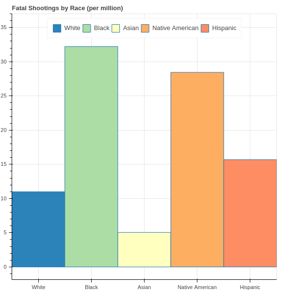

# Fatal Police Shootings
This repository works with the [fatal police shootings](https://github.com/washingtonpost/data-police-shootings) data provided by the Washington Post. The data itself is maintained in a repository which we include in this project as a submodule which we intend to periodically update to stay current while also maintaining working code.

## Current Highlights
### DataLoader module
The `DataLoader` module loads the data with "reasonable default behavior" such as enumerating categorical variables in a meaningful way. It's meant to be a simple starting point for visualizations and testing models. Some of these conversions, however, are subjective, so pay attention to the converter functions used to ensure the manipulations still suit your use case. You can of course just simplify the `get_data` function to not use any converters and not specify which columns to load to get an unmodified version of the data.

### Visualizations module
The `Visualizations` module can generate (currently only 2) plots for you using bokeh. Below is an example of using the `DataLoader` module to get the data as a pandas `DataFrame` and showing a plot (in your browser) of the fatal police shootings by race per million of that race (according to 2019 census data).
```python
from src.DataLoader import ShootingsDataLoader
from src import Visualizations

sdl = ShootingsDataLoader()
df, _ = sdl.get_data(train_frac=1, as_df=True, shuffle=False)

Visualizations.plot_shootings(df)
```
